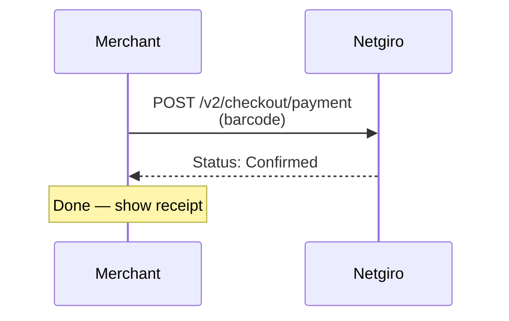
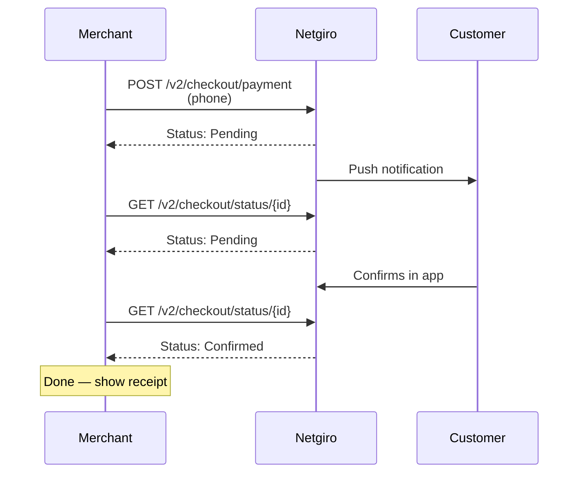
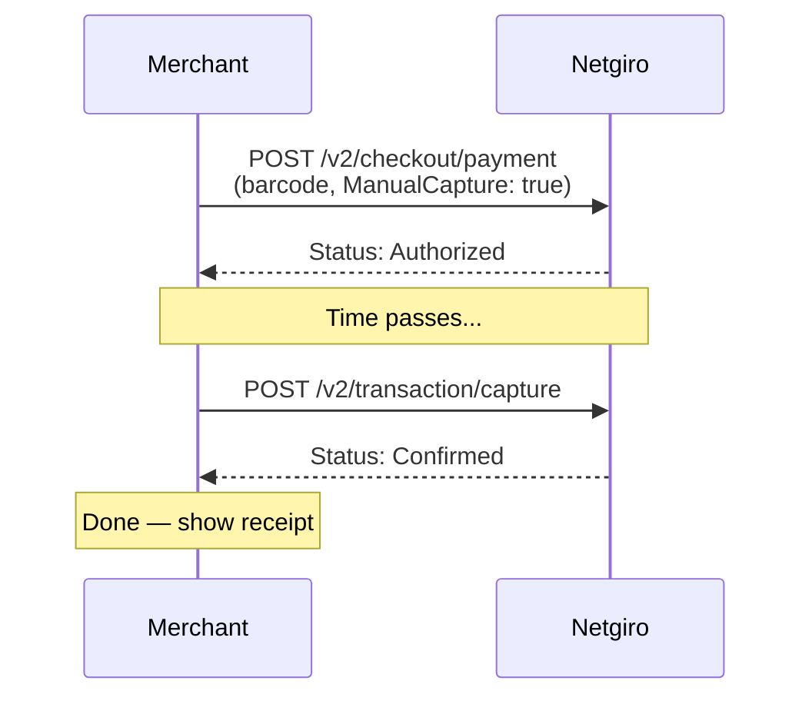
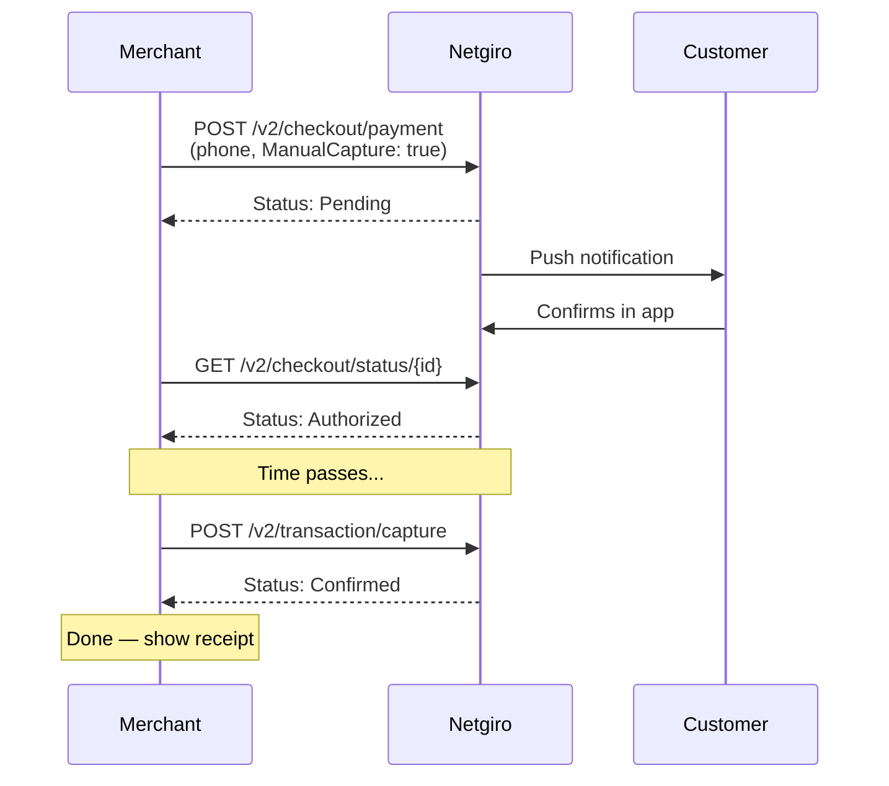

# Checkout Flows

This page describes the different checkout flows depending on the customer identifier type and capture mode.

## POS — barcode (instant)

The simplest flow. A barcode scan at the register triggers instant payment.

1. **POST** `/v2/checkout/payment` with barcode as `CustomerIdentifier`
2. Response: `Status: Confirmed` — done

## POS/Online — phone number (remote)

The customer confirms in the Netgiro app. The merchant polls for status or receives a callback.

1. **POST** `/v2/checkout/payment` with phone as `CustomerIdentifier`
2. Response: `Status: Pending`
3. Customer confirms in Netgiro app
4. Merchant polls **GET** `/v2/checkout/status/{id}` — eventually `Status: Confirmed`
5. _(Or receives callback if `CallbackUrl` was provided)_

## Authorization — barcode (hold + capture)

For scenarios where the merchant wants to hold funds before charging (e.g., hotel check-in, rental).

1. **POST** `/v2/checkout/payment` with `ManualCapture: true` + barcode
2. Response: `Status: Authorized`
3. Later: **POST** `/v2/transaction/capture`
4. Response: `Status: Confirmed`

## Authorization — phone (hold + capture)

Combines remote confirmation with manual capture.

1. **POST** `/v2/checkout/payment` with `ManualCapture: true` + phone
2. Response: `Status: Pending`
3. Customer confirms in Netgiro app
4. Merchant polls **GET** `/v2/checkout/status/{id}` — eventually `Status: Authorized`
5. Later: **POST** `/v2/transaction/capture`
6. Response: `Status: Confirmed`

