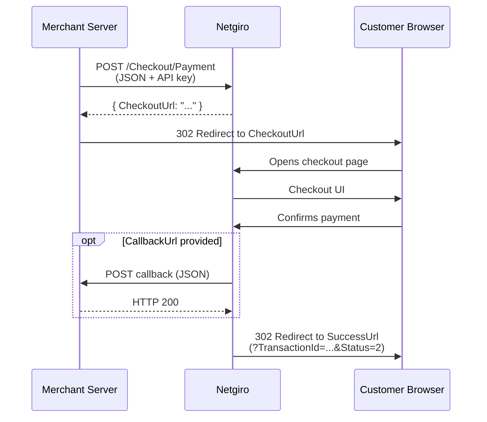
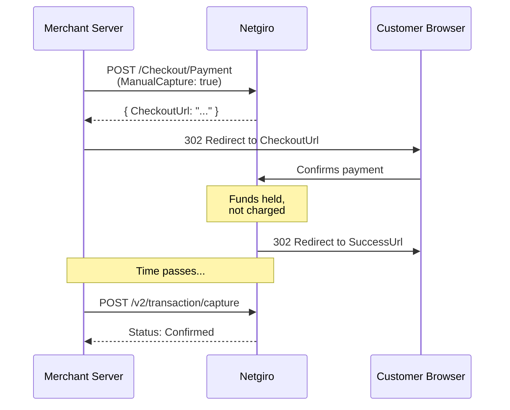

# Flow Diagram

## Standard flow

## Confirmation types

The combination of `ManualCapture` and `CallbackUrl` determines how the payment is confirmed:

| ManualCapture | CallbackUrl | Behavior |
|---------------|-------------|----------|
| `false` (default) | not provided | **Automatic** — payment confirmed immediately after customer approves |
| `false` | provided | **Server callback** — Netgiro calls your CallbackUrl when customer confirms |
| `true` | any | **Authorization** — payment becomes a reservation, merchant captures later |

## Authorization flow

Set `ManualCapture: true` to hold funds without charging. Useful for bookings, pre-orders, or any scenario where you need to confirm availability before charging.

After the customer confirms:

1. Funds are held on the customer's account
2. When ready to charge, call [POST /v2/transaction/capture](/docs/api/transaction/capture)
3. To release the hold without charging, call [POST /v2/transaction/cancel](/docs/api/transaction/cancel)
