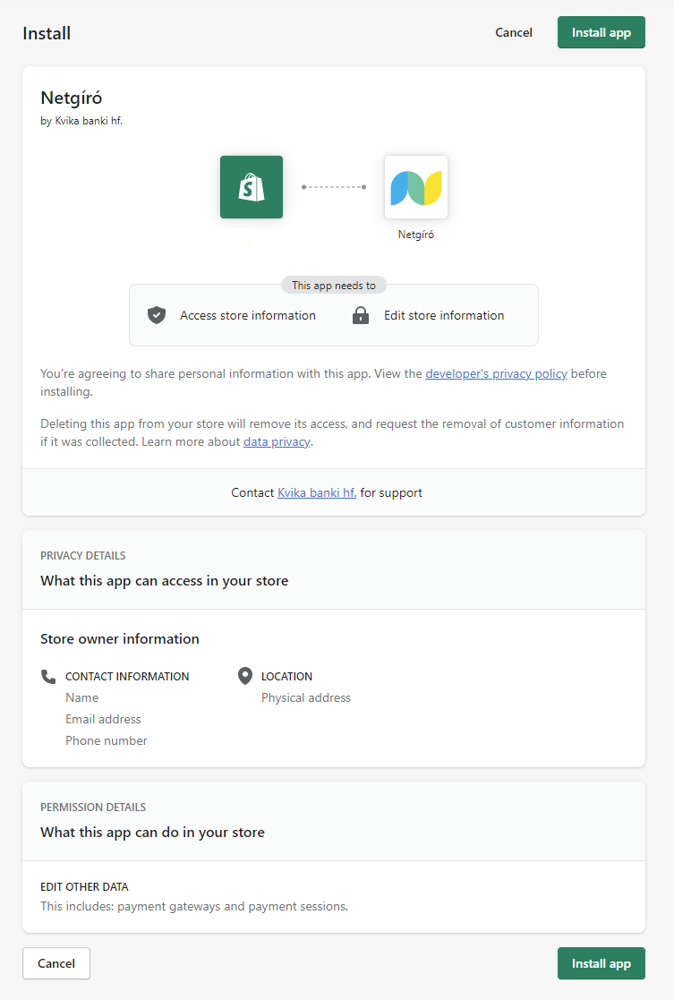
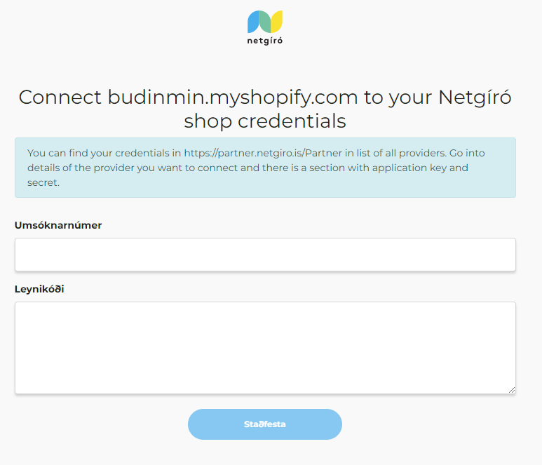
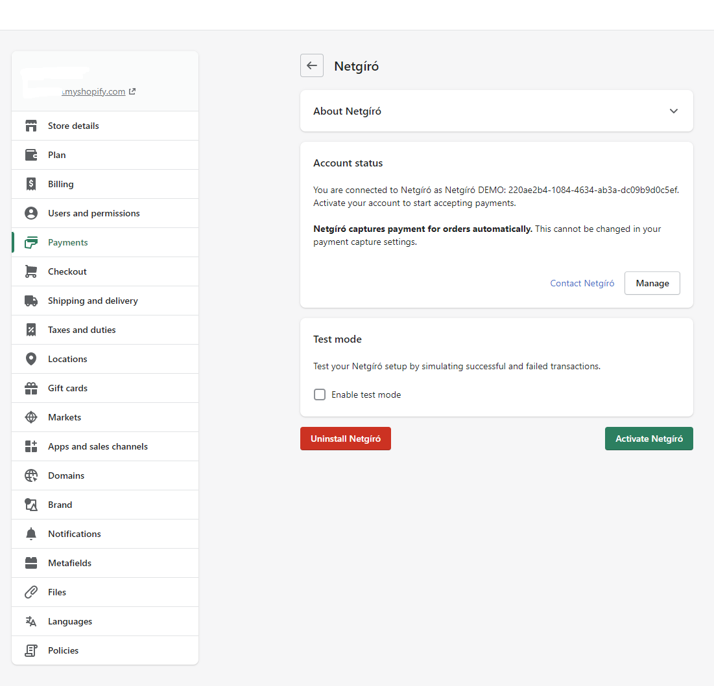

## Installing the new Netgíró payments integration for Shopify

- [Click here](https://apps.shopify.com/netgiroapp) to go to the Netgíró app listing.  Press the "Add app" button.  You might be promted to login to your shopify account if you are not logged in already.

- Shopify will redirect you to an install page where you can review information about the app you are about to install.

    
- Press the "Install app" button.  This will redirect you to a page where you need to the your Netgiro Application ID and Secret Key.

    

- Enter your production ApplicationId and SecretKey codes.  Codes can be found on [Netgíró partner portal](https://partner.netgiro.is).  Login to the portal and go to Stillingar->Grunnupplýsingar, press the "Listi yfir öll vörumerki" and select the store you are connecting to Shopify.  If you have problems finding your ApplicationId and/or SecretKey, please contact Netgiro customer support.

- After entering your credentials and pressing "Staðfesta" you should be redirected back to the Netgiro app page in Shopify admin settings.
  
    

- Press the "Activate Netgíró" button to activate Netgíró as a payment option on your store.  
- On this page you can also enable test mode by checking the "Enable test mode" feature and saving the changes.  **If you do enable test mode please be sure to disable it as soon as you have done testing.**